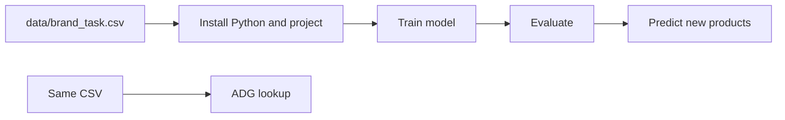

# Client guide — Brand classification project

**Who this is for:** Anyone who needs to run or understand this project **without** being a machine-learning expert. No prior Python experience is required if you follow the steps exactly.

---

## 1. What this project does (in plain language)

Your data is a **list of retail products**. Each row has:

- A **product name** (often in Armenian, sometimes English),
- A **brand**,
- An **industry / category** (e.g. Beverages, Electronics),
- An **ADG code** — a **numeric code** your business uses to classify products.

This project gives you **three practical capabilities**:

| Capability | Question it answers | How it works (simple) |
|------------|---------------------|------------------------|
| **A. Predict ADG from text** | “Given a product description, which **ADG code** should we use?” | A **neural network** (BiLSTM) reads the text and suggests codes with probabilities. |
| **B. Evaluate quality** | “How good are those predictions on held-out data?” | The program measures **accuracy**, **F1**, etc., and saves a report. |
| **C. Look up brand & industry from a code** | “We only know **ADG code 2101** — what **brand** and **industry** appear most often for that code in our data?” | **No AI** — it counts rows in your spreadsheet for that code and picks the most common brand and category. |

**Important:** (A) and (B) use the **same trained model**. (C) uses only **statistics from your CSV**, not the neural network.

---

## 2. Words you will see

| Term | Simple meaning |
|------|----------------|
| **ADG code** | A number that labels a product type or tax/category bucket in your system. |
| **BiLSTM** | A type of neural network good for **text**; “bi” means it reads left-to-right and right-to-left for context. |
| **Train / training** | Feeding examples to the model so it learns patterns (takes time; creates large files). |
| **Validation** | A portion of data held back to test how well the model generalizes. |
| **Artifact** | Any **output file** produced by the program (models, reports, caches). |
| **Repository (repo)** | This project folder, usually downloaded from GitHub. |
| **Virtual environment (venv)** | An isolated Python setup so this project’s libraries do not break other programs. |

---

## 3. Folder structure (what each part is for)

Think of the project as **input → program → output**.

```text
test_data_cleaning/                 ← Project root (open terminal here)
├── data/
│   └── brand_task.csv              ← YOUR DATA (product names, brands, categories, ADG codes)
├── artifacts/                      ← OUTPUTS (created or updated when you run commands)
│   ├── bilstm_best.keras           ← Trained model (large; often not in Git — you generate it)
│   ├── label_encoder_classes.json  ← Maps model outputs to real ADG numbers
│   ├── cleaned_training_data.csv   ← Cleaned copy of data used for evaluation
│   ├── evaluation_report.txt       ← Full evaluation metrics
│   └── adg_brand_category_stats.json  ← Cache for “code → brand/industry” lookup
├── src/brand_classification/       ← THE PROGRAM CODE (you usually do not edit this)
│   ├── config.py                   ← Paths to data and artifacts
│   ├── preprocessing.py          ← Cleans text
│   ├── data_loader.py              ← Loads CSV and prepares training table
│   ├── train.py                    ← Trains the BiLSTM
│   ├── evaluate.py                 ← Measures performance
│   ├── predict.py                  ← Predicts ADG from new text
│   └── adg_lookup.py               ← ADG code → brand & industry (from CSV counts)
├── tests/                          ← Automated checks (optional for end users)
├── docs/
│   └── CLIENT_GUIDE.md             ← This file
├── pyproject.toml                  ← List of required Python libraries
├── README.md                       ← Short technical overview + benchmark numbers
└── LICENSE                         ← Legal terms (MIT)
```

**Rule of thumb:**

- Put **your spreadsheet** in `data/brand_task.csv` (same column names as documented).
- Run commands from the **project root** (the folder that contains `data/` and `src/`).
- Expect **new files** to appear under `artifacts/` after training or evaluation.

---

## 4. End-to-end workflow (recommended order)



**Step-by-step:**

1. **Install** Python and this project (see Section 5).
2. **Train** once (`train`) — creates the `.keras` model files in `artifacts/`.
3. **Evaluate** (`evaluate`) — see how good the model is; updates `evaluation_report.txt`.
4. **Predict** (`predict`) — type product name / brand / category → get suggested ADG codes.
5. **Lookup** (`adg_lookup`) — type an ADG code → get typical brand and industry **from your historical data**.

You can skip training **only if** someone gives you a copy of the trained `bilstm_best.keras` (and related small JSON files) into `artifacts/`.

---

## 5. First-time setup (copy-paste friendly)

### 5.1 Prerequisites

- **Python 3.9 or newer** installed.
- **Internet** for the first `pip install` (unless your IT provides an offline bundle).

### 5.2 Open a terminal in the project folder

- **Windows:** Shift + right-click the folder → “Open in Terminal” or use PowerShell and `cd` to the folder.
- **Mac:** Terminal → `cd` drag-and-drop the folder path.

### 5.3 Create and activate a virtual environment

**Mac / Linux:**

```bash
python3 -m venv .venv
source .venv/bin/activate
```

**Windows:**

```bash
python -m venv .venv
.venv\Scripts\activate
```

You should see `(.venv)` at the start of the line.

### 5.4 Install the project

```bash
python -m pip install -U pip
pip install -e .
```

Wait until it finishes without errors.

### 5.5 (Optional) Run automated tests

```bash
pip install -e ".[dev]"
pytest
```

If tests pass, the install is healthy.

---

## 6. Commands reference (what to run and what it does)

Run these **from the project root** with the virtual environment **activated**.

### 6.1 Train the model

```bash
python -m brand_classification.train
```

- **Reads:** `data/brand_task.csv`
- **Writes:** Model files under `artifacts/` (e.g. `bilstm_best.keras`, `bilstm_final.keras`), plus `label_encoder_classes.json`, `cleaned_training_data.csv`
- **Time:** Can take **many minutes** on a laptop CPU — this is normal.

### 6.2 Evaluate performance

```bash
python -m brand_classification.evaluate
```

- **Needs:** A trained model and cleaned data in `artifacts/`
- **Writes:** Updates `artifacts/evaluation_report.txt`
- **Shows:** Accuracy, F1, top-3 accuracy in the terminal (summary numbers are also in `README.md`)

### 6.3 Predict ADG from product text

```bash
python -m brand_classification.predict -n "YOUR PRODUCT NAME" -b "BrandName" -c "CategoryName" --top-k 5
```

Example:

```bash
python -m brand_classification.predict -n "Նեսկաֆե գոլդ 75գ" -b "Nescafe" -c "Beverages" --top-k 5
```

- **Needs:** `artifacts/bilstm_best.keras` and `label_encoder_classes.json`
- **Output:** Top 5 ADG codes with probabilities

If you already built the long text yourself (same format as training), use `-t` instead of `-n/-b/-c`:

```bash
python -m brand_classification.predict -t "product text [BRAND] X [CAT] Y"
```

### 6.4 Look up brand and industry from an ADG code

```bash
python -m brand_classification.adg_lookup 2101
```

- **Reads:** `data/brand_task.csv` (and may use `artifacts/adg_brand_category_stats.json`)
- **Does not** use the neural network — only **counts** in your data.

After you **replace** `brand_task.csv`, rebuild the cache:

```bash
python -m brand_classification.adg_lookup --rebuild-cache
```

JSON output (for integration with other tools):

```bash
python -m brand_classification.adg_lookup 2101 --json
```

---

## 7. What each Python module does (technical but short)

| Module | Role |
|--------|------|
| `config.py` | Defines where `data/` and `artifacts/` live on disk. |
| `preprocessing.py` | Normalizes spaces and punctuation in text fields. |
| `data_loader.py` | Loads the CSV, removes bad rows, builds one text field for the model. |
| `train.py` | Builds and trains the BiLSTM, saves weights. |
| `evaluate.py` | Loads the model, recomputes the same train/validation split, prints metrics. |
| `predict.py` | Loads the model, runs inference on the text you provide. |
| `adg_lookup.py` | Aggregates brand/category frequencies per ADG code. |

---

## 8. Dataset rules (must match)

The file **`data/brand_task.csv`** should have at least these columns:

| Column | Meaning |
|--------|---------|
| `ADG_CODE` | Number (can be empty for some rows — those rows are skipped for training) |
| `GOOD_NAME` | Product title/description |
| `BRAND` | Brand label |
| `CATEGORY` | Industry or product category |

If column names or locations change, the code in `data_loader.py` must be updated by a developer.

---

## 9. Troubleshooting (common problems)

| Problem | What to do |
|---------|------------|
| `python` not recognized | On Mac/Linux try `python3`. On Windows reinstall Python and enable “Add to PATH”. |
| `pip install` fails | Run `python -m pip install -U pip setuptools wheel`, then `pip install -e .` again. |
| “Model not found” when predicting | Run **train** first, or copy `bilstm_best.keras` into `artifacts/`. |
| Training is very slow | Expected on CPU; close other heavy apps; be patient. |
| Wrong ADG after data update | Retrain (`train`), then `evaluate`. For lookup only, run `adg_lookup --rebuild-cache`. |
| Permission errors on Windows | Run terminal as normal user (not always Admin); avoid folders with special permissions. |

---

## 10. Where to read more

- **`README.md`** — Quick reference, folder tree, benchmark metrics, example predictions.
- **`artifacts/evaluation_report.txt`** — Full per-class metrics after evaluation.
- **`LICENSE`** — MIT license terms.

---

## 11. Checklist before you say “it works”

- [ ] Python 3.9+ installed  
- [ ] Virtual environment created and activated  
- [ ] `pip install -e .` completed without errors  
- [ ] `data/brand_task.csv` is present and valid  
- [ ] `python -m brand_classification.train` finished  
- [ ] `python -m brand_classification.evaluate` runs  
- [ ] `python -m brand_classification.predict ...` returns codes  
- [ ] `python -m brand_classification.adg_lookup <code>` returns brand and industry  

---

*Document version: 1.0 — aligns with the repository layout and commands in `README.md`.*
